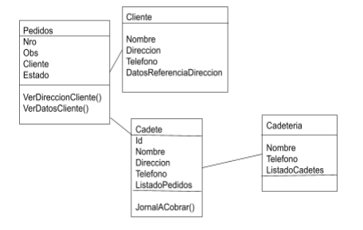

# Punto 2a

- ¿Cual de estas relaciones considera que se realiza por composición y cual por agregación?
    La relación Pedidos-Cliente es de composición, pues si no existe uno entonces no existe el otro.
    La relación Pedidos-Cadetes es de Agregación, pues para un pedido existen varios cadetes y el cadete puede existir sin tener ningún pedido.
    La relación Cadetes-Cadetería es de composición, pues si la cadeteria no existe entonces el cadete no pertenece a ningun lugar.

- ¿Qué métodos considera que debería tener la clase Cadetería y la Clase Cadete?
    Cadete debería ser un método constructor (pues debe generar los datos del cadete para ser listado en la Cadetería).
    Cadetería debería ser un método constructor (pues crea el establecimiento y enlista a sus cadetes).

- Teniendo en cuenta los principios de abstracción y ocultamiento, que atributos, propiedades y métodos deberían ser públicos y cuales privados.

    Considerando que hablamos de un sistema de Cadetería entonces:
    **Cadetería**

        public: Nombre, Telefono (disponible para todos).

        private: listado de cadetes (solo disponible para la cadeteria).

    **Cadete**
        public: nombre, telefono, direccion.

        private: id, listadoPedidos, JornalACobrar().

    **Pedidos**

        public: nro,obs,cliente,estado,VerDireccionCliente(),VerDatosCliente().
        
        
        private:

    **Cliente**
        
        
        public: nombre, direccion,telefono,DatosReferenciaDireccion
        
        
        private:

- ¿Como diseñaría los constructores de cada una de las clases?
    Para el caso de Cadete y Cadeteria haría un diseño de inicialización, es decir, creo todos los datos con un método para Cadete y Cadeteria.
    Para el caso del cliente y el pedido, crearía un método que permita al usuario ingresar sus datos (verificando que sean coherentes) y el pedido que desea.

- ¿Se le ocurre otra forma que podría haberse realizado el diseño de clases?
    Sí, haría un cambio en el las relaciones de las clases, haría que Pedidos se relacione con Cadetería para poder tener mayor control de los cadetes disponibles y devolverle al cliente un mensaje si su pedido puede ser enviado.

    